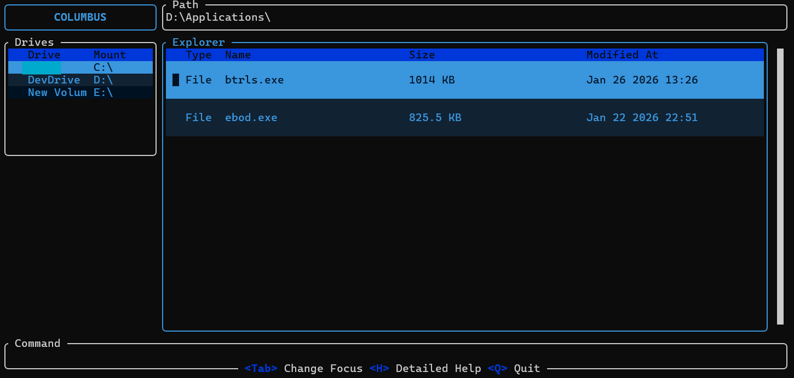

# `columbus`



A Terminal User Interface(TUI) file explorer created in `Ratatui` and `Rust`.

## Why `columbus`?

`columbus` is created as a TUI file explorer that looks like a normal GUI file manager that most of the people are used too. This way people can use a full fledged powerful file explorer directly from their terminal instead of hopping between apps every single time.

## Features that `columbus` offers

1. A more familiar User interface 
2. Screen segregated into 
    * Explorer
    * Path Field
    * Drives
    * Quick Access
    * Command bar
3. Can open applications on `enter` based on the commands provided in  `file_options.toml` configuration file.

## Installation

<!-- ### With Cargo


### From AUR -->


### Building from source

Clone the repository and `cd` into it. Run the command

```bash
cargo build --release
```

To build a release in `<PATH_TO_REPO>/target/release` folder. You can find an executable file called `columbus`. You can add `<PATH_TO_REPO>/target/release` to your system's `PATH` variable or move the executable to some other already added path.

## Usage

```bash
columbus [OPTIONS] [<PATH>]
```

### Options

* `-a` or `--include-hidden` -> To display the hidden files also in explorer

## Keybindings

### Universal Keybindings

* `h` -> Help Overview
* `a` -> Input mode in the Path Field
* `:` -> Input mode in Command bar
* `Tab` -> Used to cycle through the explorers and input fields
* `q` -> Exits the app

### Explorer

* `j | k` -> Up / Down selection
* `r` -> Refresh the explorer
* `c` -> Copy the selected file/directory
* `v` -> Paste the copied file/directory
* `x` -> Cut the selected file/directory
* `delete` -> Delete the selected item
* `Enter` ->
    * **On File** -> Opens the file if the file extension is supported and defined in `file_options.toml` configuration file.
    * **On Directory** -> Navigates into the directory.

### Path Field

* `a` -> Enter Input Mode (Characters typed are registered. All Keybindings are disabled.)
* `Esc` -> Exit Input Mode
* `Enter` -> Navigate to the provided `PATH`

### Drives Explorer

* `j | k` -> Up / Down selection
* `Enter` -> Navigate into the selected drive
* `r` -> Refresh the drives menu

### Command Bar

* `a` -> Enter Input Mode (Characters typed are registered. All Keybindings are disabled.)
* `Esc` -> Exit Input Mode
* `Enter` -> Execute the entered command with the given arguments

### Quick Access

* `j | k` -> Up / Down selection
* `Enter` -> Navigate into the selected Folder

### Help Overview
* `j | k` -> Up / Down Navigation
* `q` -> Close Help Overview

## The Command Bar

A trial implementation of a command parsing widget in `columbus`. It provides commands to create new files, directories and many more. The commands that have been implemented as of now are:

### Create a new file

A new file can be created in `columbus` with the `n` command.

```bash
n <FILENAME>
```
Here <FILENAME> is with extension. Executing this command with create the new file in the current explorer's path.

### Create a new directory

A new directory can be created in `columbus` with the `b` command.

```bash
b <DIRECTORY NAME>
```
Executing this command with create the new directory in the current explorer's path.

### Rename Operation

You can rename existing files or directories with the help of `r` command in `columbus`

```bash
r <OLD_EXISTING_NAME> <NEW_NAME>
```

Executing this command will search for the `<OLD_EXISTING_NAME>` and then rename it to the `<NEW_NAME>`.

## Quick Access Explorer

The **Quick Access Explorer** works with the help of `qa_files.toml` configuration file. This file is created, read and updated by `columbus` itself and doesn't require user intervention.

It works by registering the directories you visit and how many times you visit them. All the data is stored in `qa_files.toml` file. The stored data is retrieved and sorted in decresing order of number of times of access. Then the top 20 results are displayed to you in the **Quick Access Explorer**.

This way you can access you most accessed directories from anywhere.

## Log Field

The `log` field is present in the bottom of the screen. This is to log any errors that occur during the program. If `columbus` didn't do something that you asked it to do, check here for any errors. If no errors, then raise a issue in the repository.

## Configuration files

`columbus` depends on `file_options.toml` configuration file for opening files. Hence absence of `file_options.toml` means you cannot open any file through `columbus`.

`file_options.toml` is searched for in `D:\Applications\columbus\file_options.toml` location in **Windows**.

In **Linux**, `columbus` looks for the file in `~/.config/columbus/file_options.toml`

### `file_options.toml` file structure

The configuration file is in the structure:
```toml
txt = "notepad"
c = "notepad"
rs = "notepad"
cpp = "notepad"
toml = "notepad"
pdf = "cmd /c start msedge"
svg = "cmd /c start msedge"
mp4 = "vlc"
mp3 = "C:\\VLC\\vlc.exe"
sh = "notepad"
jpg = "cmd /c start "
png = "cmd /c start "
```

This is in correspondence to the `struct` `FileOptions` in `/src/open_files.rs`.

The list of file extenstions for which open on enter works is:

|Supported|File|Extensions|
|---|---|---|
| txt   | toml  | java  |
| pdf   | html  | kt    |
| mp4   | css   | json  |
| mp3   | js    | zig   |
| c | gitignore | odin  |
| cpp   | ts    |   |
| rs    | tsx   |   |
| png   | py    |   |
| jpg   | md    |   |
| svg   | jsx   |   |
| sh    | rb    |   |

The order of the entries do not matter. Provide the command in such a way that it can be seperated into two parts `command` and the `arguments list`. The `FILEPATH` will be added to the last of the arguments list. 

Please make sure to escape backslashes `\` with another backslash, like `\\`. This is to prevent `TOML` parsing errors.

The file opening mechanism is totally based on the commands provided by the user in `file_options.toml` file. Hence please make sure to test the command before entering it here.

**NOTE:** DO NOT open other TUI applications from `columbus`. For such applications, please create a seperate terminal window.

---

For any issues encounterd in `columbus` please post a Github issue in the repository. 

Thank You!!